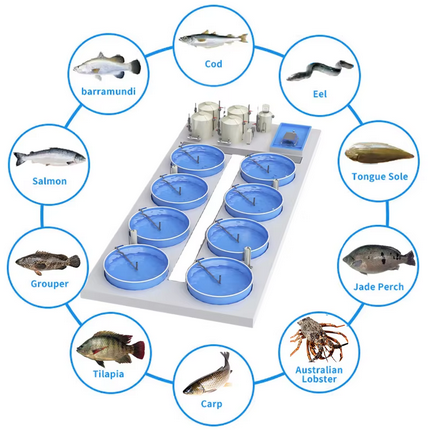
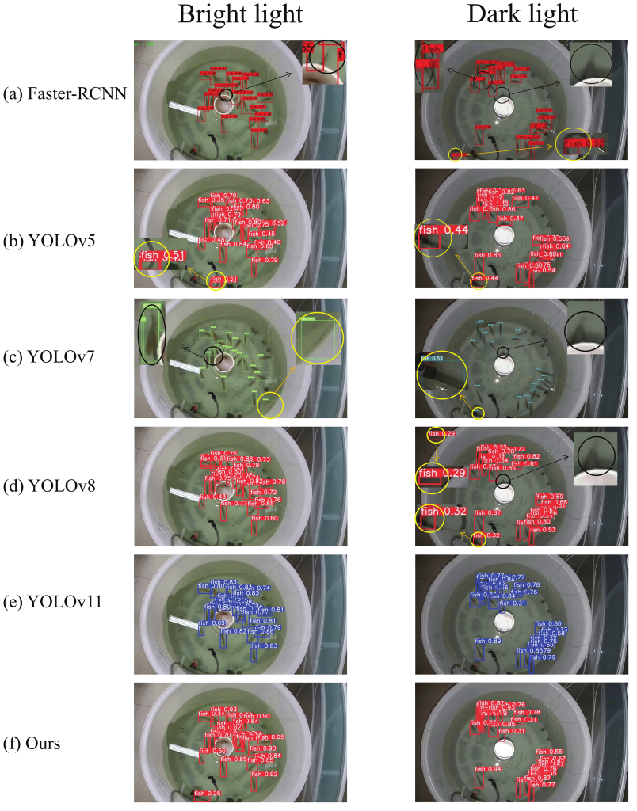
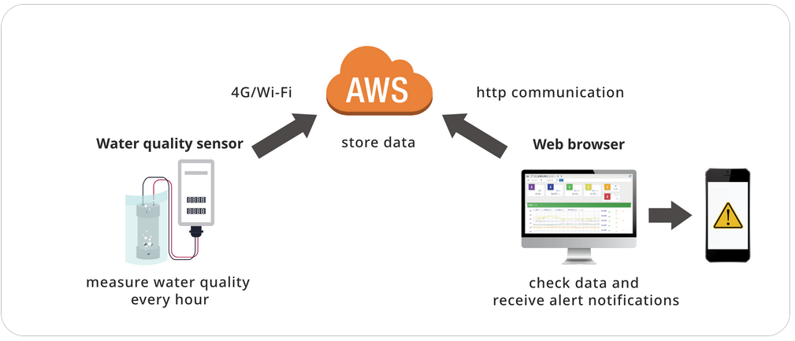

# Smart Fish Farming Project Analysis

# Introduction

Repository này dùng để nghiên cứu, thiết kế, phân tích và triển khai mô hình nuôi cá công nghệ cao (cá chình, cá lóc, cá rô phi, cá chẽm, ...) dựa trên:

- RAS (Recirculating Aquaculture System)

- Computer Vision (Fish monitoring & tracking)

- IoT‌ ‌/ Automation (Sensors system)

Mục tiêu cuối cùng không chỉ xây dựng một fish farm nuôi cá công nghệ cao mang lại lợi nhuận, mà xây dựng nền tảng thủy sản có thể nuôi đa loài thủy sản dù nước mặn, lợ, ngọt áp dụng công nghệ có tính tự tin cao và khả năng mở rộng.

## Scope

Reposioty bao gồm:

- Nghiên cứu thị trường

- Mô hình kinh doanh

- Phân tích kinh tế

- Thiết kế RAS

- Phân tích cá (đặc điểm sinh học và kỹ thuật nuôi)

- Quản trị rủi ro

- Kế hoạch triển khai

...

## Rule

Mỗi thư mục chỉ giải quyết một vấn đề duy nhất

Không trung lập nội dung giữa các thư mục

Kiến thức có số liệu thực tế, nguồn tham khảo và khả năng áp dụng thực tế

