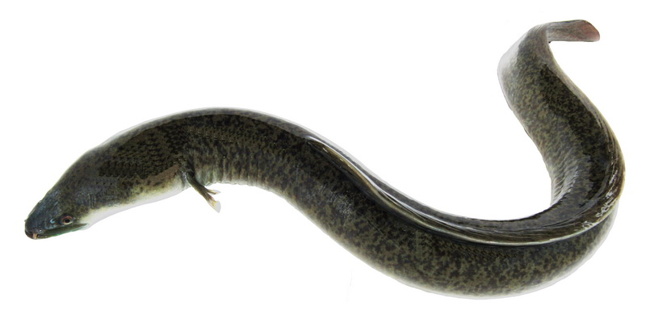

# EEL OVERVIEW

## Giới thiệu

Cá chình là một trong những đối tuợng nuôi thủy sản có giá trị kinh tế cao, đặc biệt tại các thị trường châu Á như: Nhật Bản, Trung Quốc, Hàn Quốc và Việt Nam

Cá chình là tên gọi chung của nhiều loài thuộc họ Anguillidae, sống chủ yếu ở môi trường nước ngọt hoặc vùng cửa sông ven biển. Chúng có hình dáng dài, trơn, thân hình giống lươn, tuy nhiên cấu trúc sinh học khác biệt.

Tại Việt Nam, cá chình được phân bố chủ yếu ở các sông lớn và vùng trung du. Một số loài có giá trị kinh tế cao như: cá chình suối, cá chình hoa, cá chình mun, ... Cá chình nổi tiếng với thịt dai, béo, có hương vị đặc trưng và thường xem là đặc sản ở nhiều vùng.

