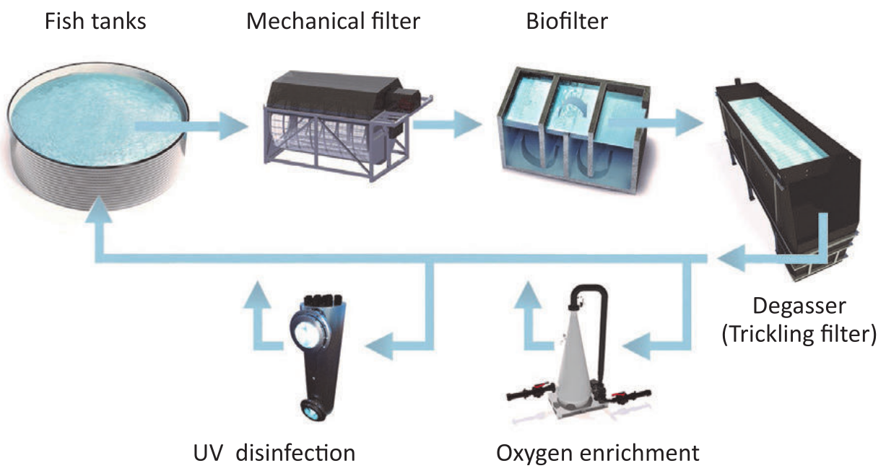

# RAS ARCHITECTURE

## Giới thiệu

Hệ thống RAS (Recirculating Aquaculture System) nổi bật như một công nghệ nuôi cá thủy sản nổi bật nhất hiện nay.

RAS khẳng định hiệu quả vượt trội trong phục vụ sản xuất giống và nuôi thâm canh các loài thủy sản nước ngọt, lợ, mặn.

## Định nghĩa và Nguyên lý hoạt động

RAS sử dụng phương pháp tái sử dụng nước, tối ưu hóa môi truờng sống và nâng cao hiệu quả sản xuất. Hệ thống này họat động dựa trên nguyên tắc lọc và xử lý nước thải từ các bể nuôi, sau đó đưa nước đã được xử lý trở lại bể, tạo thành một chu trình tuần hoàn khép kín.

Cụ thể, hệ thống RAS hoạt động dựa theo các bước sau:

- Lắng và lọc cơ học: Nước thải từ bể nuôi được dẫn về bể lắng, nơi các chất rắn lớn hoặc loại bỏ bằng lắng tụ. Sau đó, nước được chảy qua các vật liệu lọc như cát, sỏi, hoặc lưới để loại bỏ các hạt rắn nhỏ hơn.

- Lọc sinh học: Nước sau khi qua giai đoạn 1 được bơm vào bể lọc sinh học. Tại đây, nước tiếp xúc với giá thể có bề mặt lòi lõm, tạo môi trường thuận lợi cho vi khuẩn hiếu khí phát triển. Vi khuẩn này sẽ chuyển hóa NH3 và Nitrite thành Nitrat, giảm thiểu độc tính của nước.

- Sục khí: Hệ thống sục khí liên tục cung cấp oxy cho quá trình phân hủy của vi khuẩn và loại bỏ CO2 dư thừa trong bể lọc sinh học.

- Tái sử dụng nước: Nước đã được xử lý qua các bước trên sẽ được bơm trở lại bể nuôi, duy trì môi trường nước sạch và ổn định cho thủy sản phát triển.

## Ưu điểm vượt trội của RAS

- Tiết kiệm nước: hệ thống có khả năng tái sử dụng đến 90% nước, giảm thiểu nhu cầu lấy nước từ môi trường tự nhiên, đặc biệt hữu ích trong các khu vực thiếu nước.

- Giảm ô nhiễm môi trường: Quá trình xử lý chất thải hiệu quả giúp giảm thiểu phát thải ra môi trường, đồng thời bảo vệ nguồn nước và hệ sinh thái.

- Kiểm soát chắc lượng nước tốt hơn: Hệ thống giữ cho môi trường nuôi ổn định và kiểm soát chặt chẽ các chỉ số chất lượng như pH, amoniac, nitrit, oxy hòa tan, tào điều kiện thuận lợi cho sự phát triển khỏe mạnh của cá.

- Tăng năng suất và hiệu quả nuôi trồng: Thủy sản được nuôi trong môi trường nước sạch, ít dịch bệnh, với tỉ lệ sống cao và tốc độ tăng trưởng nhanh, dẫn đến năng suất và hiệu quả nuôi cao hơn so với phương pháp truyền thống.

- Bền vững trong nuôi trồng thủy sản: Thúc đẩy phát triển ngành thủy sản.
